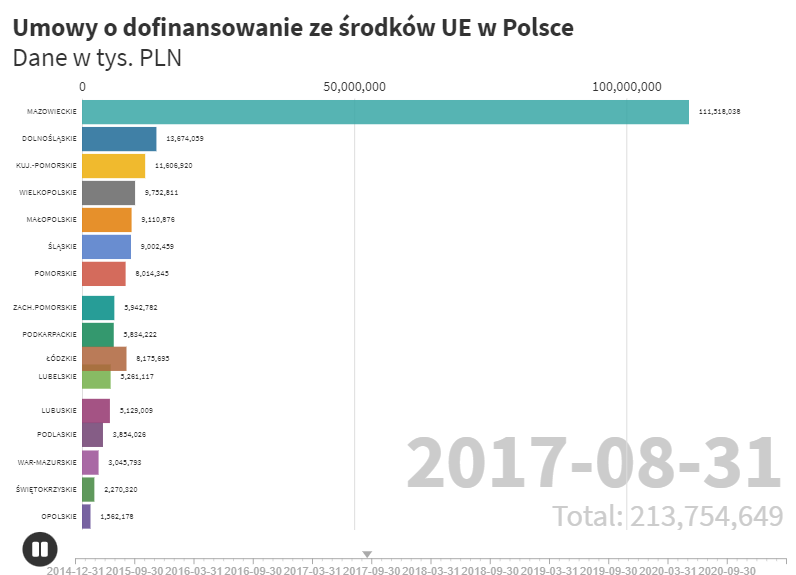
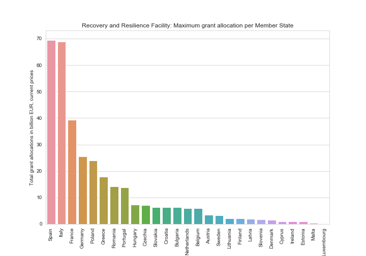
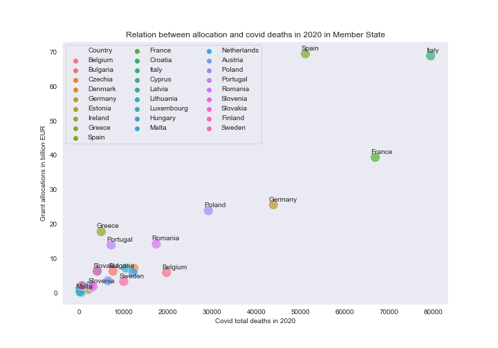
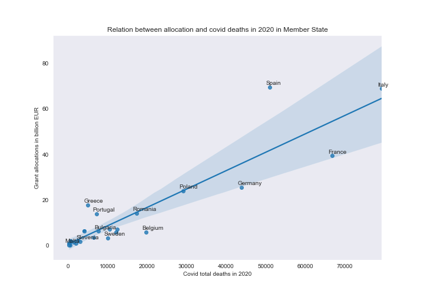

# UE
Repository cointains analyzes on European Union funds.  
<a href = "Dotacje_UE_2014_2020.ipynb">Dotacje_UE_2014_2020 </a> shows how to create an animated bar chart race. The plot presents differences in the use of funds by Polish regions. 
You can see the results by click on the image below.  
&nbsp;&nbsp;&nbsp;<a target="_blank" href='https://public.flourish.studio/visualisation/6023241/'>&nbsp;&nbsp;&nbsp;</a>
 
<a href="RRF.ipynb">RRF file</a> cointains analisys on The Recovery and Resilience Facility. This is the centrepiece of NextGenerationEU programme. 
NextGenerationEU is a more than €800 billion temporary recovery instrument to help repair the immediate economic and social damage brought about by the coronavirus pandemic.
Here are some visualizations. 

